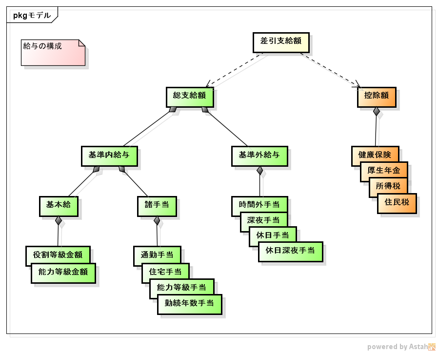
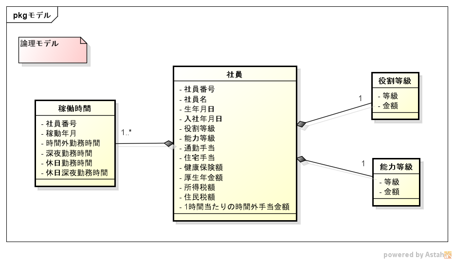
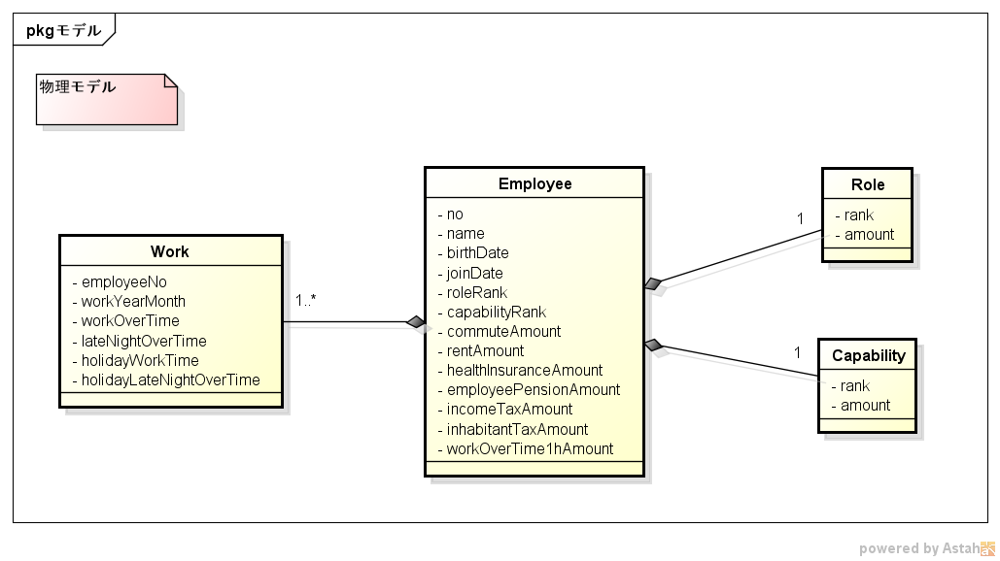

# 給与計算

master 
develop 

## 給与計算の基本構造

__差引支給額__ = __総支給額__ - __控除額__

## 総支給額の基本構造

__総支給額__ = 基準内給与 + 基準外給与

基準内給与 = 基本給 + 諸手当

基本給 = 役割等級に応じた金額 + 能力等級に応じた金額

諸手当: 通勤手当, 住宅手当, 能力等級手当(※1), 勤続年数手当(※2)

基準外給与(※3): 時間外手当, 深夜手当, 休日手当, 休日深夜手当

※1: 能力等級が PL or PM の場合
※2: 勤続年数が丸 3, 5, 10, 20 年目の場合
※3: 能力等級が PL or PM の場合、基準外給与は支払われない

## 控除額の基本構造

__控除額__ = 健康保険 + 厚生年金 + 所得税 + 住民税

----

----

# 今回使用したテーブル構造

### 論理

### 物理

----

# Eclipse 向けフォーマッターの設定

1. プロジェクト -> 右クリック -> プロパティ -> Java コード・スタイル -> フォーマッター
2. インポート -> assertj-eclipse-extend-formatter.xml を選択 -> アクティブなプロファイルが「assertj」になっていることを確認 -> 適用

----

# Start dropwizard application

`java -jar salary-calculation.jar server salary-calculation.yml`

